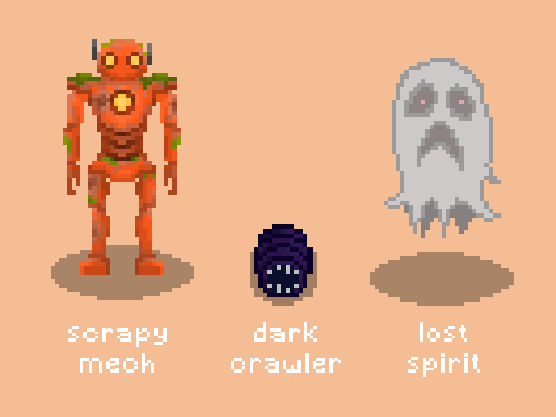
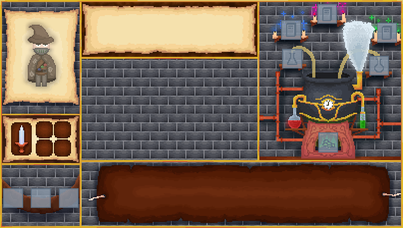
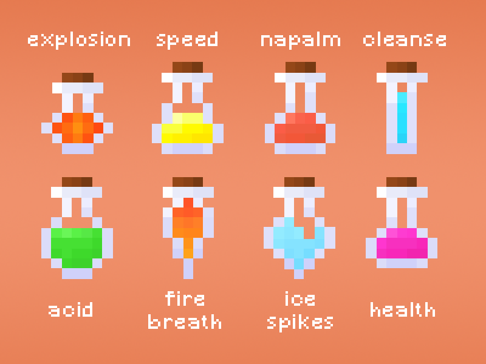
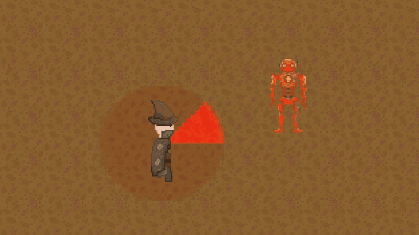
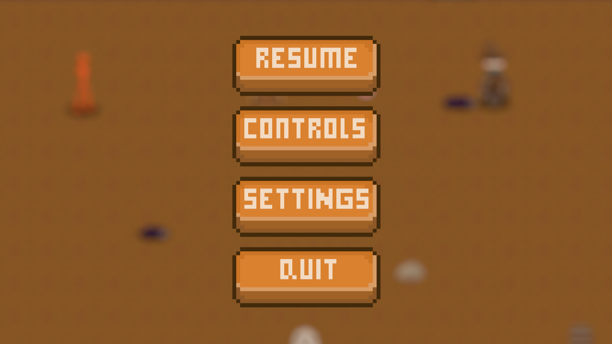

## 🎮 About a game
**Tower of the Fallen King** is a 2D roguelike game where the player controls an alchemist battling through waves of enemies. You will encounter several different opponent types throughout the various floors of levels.

## 🧪 Potions and crafting
The game features a variety of potions with effects that synergize with each other, encouraging strategic use. Even, you have access to a crafting system based on the unique aspects of ingredients rather than just their type.

## 🔪 There is also an option to play with a dagger:

## ⏸️ Pause menu:

📖 If you want to learn more about the game, visit the document below:

### →→&nbsp; [🔗 Link to the GDD](https://docs.google.com/document/d/18BCbUzjKfOp9-D-eTenoFISHoYrXm9FQe28Zrkk068U) &nbsp;←←

## Team members:
- 🧠 Team leader and Game Designer: Łukasz Trybek
- 💻 Programmers: Łukasz Rudowski, Jakub Stawicki
- 🖼️ Graphic Designers: Michał Szubiński, Remigiusz Witkowski
- 🎶 Music, SFX & Level Designer: Hubert Byzdra