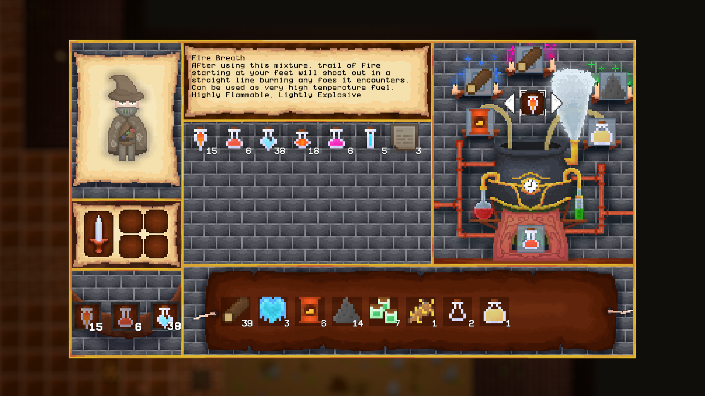

# 🎮 About a game
**Tower of the Fallen King** is a 2D roguelike game where the player controls an alchemist battling through waves of enemies. You will encounter several different opponent types throughout the various floors of levels.

# 🧪 Potions and crafting
The game features a variety of potions with effects that synergize with each other, encouraging strategic use. Even, you have access to a crafting system based on the unique aspects of ingredients rather than just their type.

# 🪵 Items
During the gameplay you can gain a lot of useful things to make potions or just to diversify your expierience. Enemies and environment (e.g. barrels, jugs) drop potions and their ingredients. After cleaning the room, the chest with loot spawns.

## 🔪 There is also an option to play with a dagger:

## ⏸️ Settings and death screen:

## 👁️‍🗨️ Game includes integration with Discord:

## 📖 If you want to learn more about the game, visit the document below:

### →→ [🔗 Link to the GDD](https://docs.google.com/document/d/18BCbUzjKfOp9-D-eTenoFISHoYrXm9FQe28Zrkk068U) ←←
 

# Team members:
- 🧠 Team leader and Game Designer: Łukasz Trybek
- 💻 Programmers: Łukasz Rudowski, Jakub Stawicki
- 🖼️ Graphic Designers: Michał Szubiński, Remigiusz Witkowski
- 🎶 Music, SFX & Level Designer: Hubert Byzdra